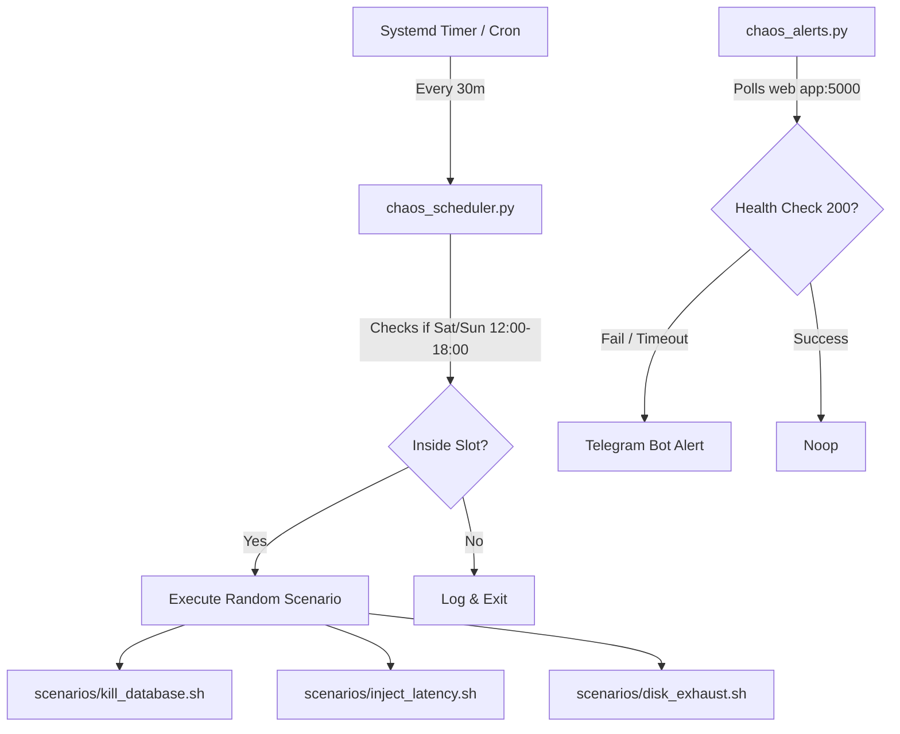

# Graduated Chaos Sandbox (Phase 1: Chaos on a Leash)

[](https://github.com/shapovalovdev/devops-chaos-sandbox/actions/workflows/ci.yml)

A lightweight Chaos Engineering framework designed for DevOps and Site Reliability Engineering (SRE) candidates. It simulates real-world production incidents directly on the candidate's sandbox VM under controlled conditions (chaos on a leash).

Resolves #1.

---

## Architecture & Workflow

The platform runs as background systemd daemons on the candidate's VM:



---

## Core Components

1. **`chaos_scheduler.py` (Scheduler):** Ensures failures only trigger during designated study slots (e.g. weekends 12:00 – 18:00 local time). If executed outside this window, it log-exits without mutating anything.
2. **`chaos_alerts.py` (Alerting):** Polls the local port (e.g., `:5000` or `/health`) and triggers immediate REST API warnings to your Telegram Bot Chat.
3. **`scenarios/` (Failures):**
   * **Dependency Kill:** Stops PostgreSQL/Flask, disables standard auto-restart, and wipes journal tails.
   * **Network Latency:** Utilizes Linux Traffic Control (`tc`) to inject `1.5s` latency on local DB connections.
   * **Disk Exhaustion:** Appends garbage data via `dd` to fill `/var/log` or database storage mounts, testing log rotation and metrics warning thresholds.

---

## Installation

Run the bootstrap installer on the sandbox VM:

```bash
curl -sSL https://raw.githubusercontent.com/shapovalovdev/devops-chaos-sandbox/main/installer.sh | sudo bash
```

Provide the following environmental variables when prompted:
* `TELEGRAM_BOT_TOKEN`: Your custom Telegram bot token.
* `TELEGRAM_CHAT_ID`: Your Telegram group/chat ID.
* `TARGET_APP_URL`: The URL to monitor (e.g. `http://localhost:5000/health`).

---

## License

This project is licensed under the Creative Commons Attribution 4.0 International License.
