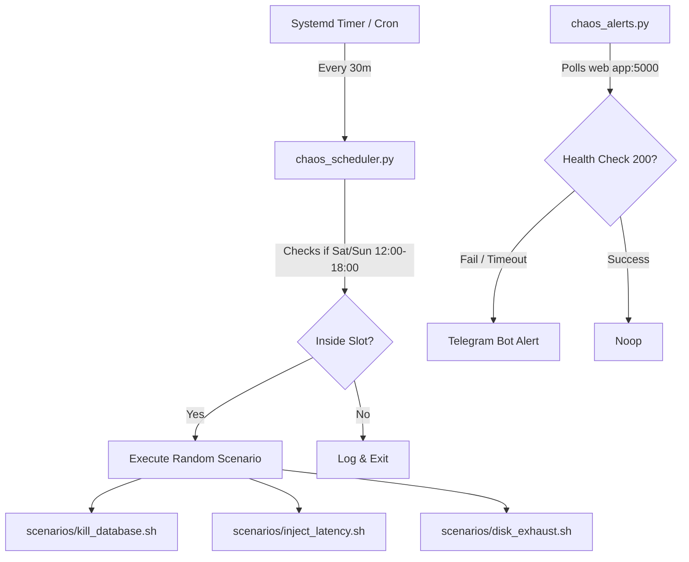

# Graduated Chaos Sandbox (Phase 1: Chaos on a Leash)

[](https://github.com/shapovalovdev/devops-chaos-sandbox/actions/workflows/ci.yml)

A lightweight Chaos Engineering framework designed for DevOps and Site Reliability Engineering (SRE) candidates. It simulates real-world production incidents directly on the candidate's sandbox VM under controlled conditions (chaos on a leash).

Resolves #1.

---

## Architecture & Workflow

The platform runs as background systemd daemons on the candidate's VM:



---

## Core Components

1. **`chaos_scheduler.py` (Scheduler):** Ensures failures only trigger during designated study slots (e.g. weekends 12:00 – 18:00 local time). If executed outside this window, it log-exits without mutating anything.
2. **`chaos_alerts.py` (Alerting):** Polls the local port (e.g., `:5000` or `/health`) and triggers immediate REST API warnings to your Telegram Bot Chat.
3. **`scenarios/` (Failures):**
   * **Dependency Kill:** Stops PostgreSQL/Flask, disables standard auto-restart, and wipes journal tails.
   * **Network Latency:** Utilizes Linux Traffic Control (`tc`) to inject `1.5s` latency on local DB connections.
   * **Disk Exhaustion:** Appends garbage data via `dd` to fill `/var/log` or database storage mounts, testing log rotation and metrics warning thresholds.

---

## System Requirements

The target Virtual Machine (VM) must meet the following baseline requirements:
*   **Operating System:** systemd-based Linux (Recommended: Ubuntu 20.04/22.04 LTS or Debian 11/12).
*   **Interpreter:** Python 3.x (standard library only; no pip dependencies required).
*   **Tools (Scenario dependent):**
    *   `docker-ce` / `docker` CLI: For database container restart control.
    *   `iproute2` / `tc`: For loopback traffic latency control.
    *   Standard GNU coreutils (`dd`, `df`, `awk`): For disk filling and monitoring.
*   **Network:**
    *   Outgoing HTTPS access to `https://api.telegram.org` (port 443) for alerting.
    *   Local route access to target web app health endpoint (port 5000/80).

---

## Installation

Run the bootstrap installer on the sandbox VM:

```bash
curl -sSL https://raw.githubusercontent.com/shapovalovdev/devops-chaos-sandbox/main/installer.sh | sudo bash
```

Provide the following environmental variables when prompted:
* `TELEGRAM_BOT_TOKEN`: Your custom Telegram bot token.
* `TELEGRAM_CHAT_ID`: Your Telegram group/chat ID.
* `TARGET_APP_URL`: The URL to monitor (e.g. `http://localhost:5000/health`).

---

## Tutorial Plan: Reaching the SRE Roadmap Goal

The sandbox progresses through three stages to build candidate capabilities in site reliability engineering:

### Phase 1: Scheduled Chaos & Live Triage (Weeks 1–2)
*   **Focus:** Core debugging loops.
*   **Execution:** Failures trigger only during allowed Saturday/Sunday 12:00–18:00 slots.
*   **Candidate Goal:** Log in live upon receiving the Telegram alarm. Diagnose the outage (Port latency? DB down? Disk full?) using `journalctl`, `docker ps`, `tc qdisc`, or `df -h`. Resolve it manually and document your Time-to-Recovery (TTR) in an incident log.

### Phase 2: Post-Mortem & Telemetry Triage (Weeks 3–4)
*   **Focus:** Time-shifted diagnostic reconstruction.
*   **Execution:** The allowed slots expand to wider study hours, including off-hours.
*   **Candidate Goal:** Open your laptop to a recovery alert or downtime logs. Reconstruct the incident timeline after-the-fact using historical telemetry: When did the failure start? Why? How long was it down? Write a formal Blameless Post-Mortem.

### Phase 3: Resilient Self-Healing Architecture (Weeks 5–6)
*   **Focus:** High availability and engineering for failure.
*   **Execution:** Failures trigger unpredictably.
*   **Candidate Goal:** Since you cannot respond immediately mid-shift, you must automate resolution. Write Ansible wait-for checks, Flask db connection retry loops, and Docker auto-restart rules. Verify the sandbox triggers failures, but the system heals itself automatically with zero human interaction.

---

## License

This project is licensed under the Creative Commons Attribution 4.0 International License.
